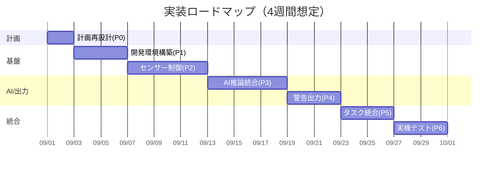

# 実装ロードマップ（4週間想定）

## フェーズ一覧と所要時間

（合計：**4週間＝100%**）

| フェーズ          | 工程内容                                       | 所要期間 | 全体割合 |
| ------------- | ------------------------------------------ | ---- | ---- |
| **P0 計画再設計**  | EK-RA8D1仕様反映、FSP/μT-Kernel構成検討             | 2日   | 7%   |
| **P1 開発環境構築** | e² studio + FSP設定、μT-Kernel移植、UART/LED動作確認 | 4日   | 14%  |
| **P2 センサー制御** | 超音波距離センサー、カメラ入力（QVGA縮小）                    | 6日   | 21%  |
| **P3 AI推論統合** | TinyMLモデル移植、INT8量子化、Helium最適化              | 6日   | 21%  |
| **P4 警告出力**   | LED・振動モータ制御、LCD表示オーバレイ                     | 4日   | 14%  |
| **P5 統合調整**   | タスク周期調整、CPU負荷測定、ジッタ確認                      | 4日   | 14%  |
| **P6 テスト・評価** | 実走行テスト、誤検知率確認、改善サイクル                       | 4日   | 14%  |

---

## 全体像（Mermaidガントチャート）

---

## 進捗管理の仕組み（4週間版）

* **進捗率** = 完了したフェーズの割合を合計

  * 例：P0+P1+P2完了 → 7%+14%+21%=**42%進捗**
* **マイルストーン**

  * M1（1週目末）: μT-Kernel起動＋UARTログ出力成功
  * M2（2週目中盤）: カメラ入力＋距離センサ取得同時実行
  * M3（3週目中盤）: AIモデル推論成功＋LCD表示
  * M4（4週目末）: 実走テスト完了＝完成

---

## ポイント

* **環境構築（P0〜P1）を最初の1週で完了**し、残り3週間を実装と検証に集中
* **センサー制御とAI統合を連続で進める**（P2→P3を最重要）
* **LCD出力（P4）は短期間で最低限**の実装（危険度とクラスのみ表示）
* **テスト（P6）は最後の週にまとめて実施**し、走行環境で誤検知を確認