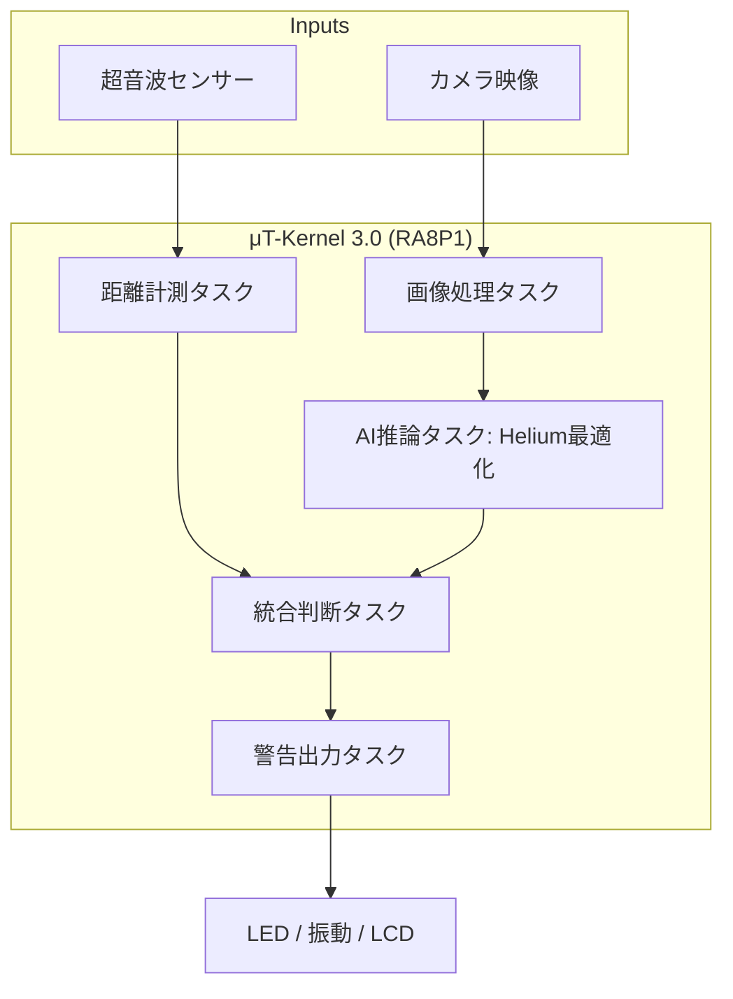

# 1. 応募プログラム名
**「Smart Rear-Guard」: μT-Kernel 3.0とRA8P1による自転車用・高精度後方接近検知システム**

# 2. 背景・課題設定
自転車事故の中でも、後方からの接近車両・バイク・歩行者への気づき遅れは重大事故につながります。既存の対策には以下の課題があります。
- **ミラー/目視**：確認タイミングが運転者依存で、暗所や疲労時に見落としが発生。
- **単一センサー**：物体種別（車か障害物か）が分からず、不要な警告が増える。
- **スマホ連携型**：通信やOSのオーバーヘッドにより、リアルタイム性・安定性に課題。

本提案は、**距離情報（超音波）× 画像AI分類（TinyML）**を組み合わせ、強力な **RA8P1** マイコン上でμT-Kernel 3.0によるリアルタイム制御を行うことで、誤警報を抑えた極めて低遅延な警告システムを実現します。

# 3. 提案概要
後方小型カメラと超音波センサーのデータを、TensorFlow Lite for Microcontrollers（以下、TFLM）で推論し、「人／車／バイク」を瞬時に分類します。
- **マルチタスク制御**：μT-Kernel 3.0上でセンシング・推論・通知を独立したタスクとして並列処理。
- **マルチモーダル警告**：危険度に応じ、LED・振動モーター・LCDの3系統でライダーに直感的な通知。

# 4. 独自性・審査員向け訴求ポイント
1. **Cortex-M85 (Helium) の性能追求**：マイコン向けベクトル演算拡張「Helium」をフル活用し、通常は重いAI処理をリアルタイムOSのタスクとして完結させます。
2. **センサーフュージョンによる信頼性**：物理的な距離とAIによる物体種別を統合。不要な警報を低減し、実用性を高めています。
3. **決定論的リアルタイム性**：μT-Kernel 3.0を採用し、各タスクの優先度と周期を厳密に管理。命に関わる安全装置としての信頼性を担保します。
4. **RA8P1のポテンシャル活用**：$480 \text{ MHz}$ の高速クロックと高性能メモリを活かし、高解像度な画像処理と高速推論を両立。

# 5. 開発体制
- **個人開発：中山 颯遵（なかやま はやのぶ）**
- **役割**：要件定義、μT-Kernelタスク設計、AIモデル量子化、ハードウェア統合。

# 6. 開発環境・使用技術
## 6.1 ハードウェア
- **Renesas RA8P1 (Arm® Cortex®-M85 & Arm® Cortex®-M33)**
    - 動作周波数：最大 $480 \text{ MHz}$
    - 機能：Helium (M-Profile Vector Extension), TrustZone対応
- **周辺機器**：MIPI LCD、CMOSカメラモジュール、超音波距離センサー、振動モーター、LED

## 6.2 ソフトウェア
- **OS/ライブラリ**：μT-Kernel 3.0、Renesas FSP (Flexible Software Package)
- **AIエンジン**：TensorFlow Lite for Microcontrollers (INT8量子化)
- **最適化**：**CMSIS-NN / Helium最適化** を適用し、従来のCortex-M7比で **$1.5 \sim 2.0$ 倍程度の高速化** を目標とします。

## 6.3 開発環境
- **ホストOS**：Windows 11 Pro
- **IDE**：Renesas `e² studio`

# 7. システム設計
## 7.1 タスク構成と周期（目標値）
| タスク | 周期 | 役割 | 目標実行時間 |
| :--- | :---: | :--- | :---: |
| 距離測定 | $50 \text{ ms}$ | 超音波計測、移動平均処理 | $2 \text{ ms}$ 以下 |
| 画像取得 | $100 \text{ ms}$ | フレーム取得・前処理（RA8P1の高速メモリ活用） | $10 \text{ ms}$ 以下 |
| **AI推論** | **$100 \text{ ms}$** | **Helium最適化済み**人/車/バイク分類 | **$25 \text{ ms}$ 以下** |
| 危険度評価 | $100 \text{ ms}$ | センサー融合、危険度（低・中・高）算出 | $3 \text{ ms}$ 以下 |
| 警告出力 | $100 \text{ ms}$ | LED/振動パターン制御 | $2 \text{ ms}$ 以下 |

## 7.2 システム構成図

# 8. 評価方法・達成目標 (KPI)
- **推論周期**：$100 \text{ ms}$ 周期を $95\%$ 以上で維持。
- **遅延時間**：接近検知からライダーへの通知まで $200 \text{ ms}$ 以内を達成。
- **誤警報率**：AI分類を併用することで、従来の距離センサー単体時より $20\%$ 以上の誤警報削減。
- **省電力性**：低リスク時は低電力モードを活用し、平均消費電流を $10\%$ 低減。

# 9. 応募者のアピールポイント
- **低レイヤの実装力**：42 Tokyoにて、標準ライブラリを使わずC言語でシステムを構築する教育を受けており、OSの仕組みやメモリ管理に精通しています。
- **最新技術への挑戦**：RA8P1という最先端のMCUを採用し、μT-Kernel 3.0とエッジAIを組み合わせることで、組込みシステムの新たな可能性を実証したいという強い意気込みを持っています。