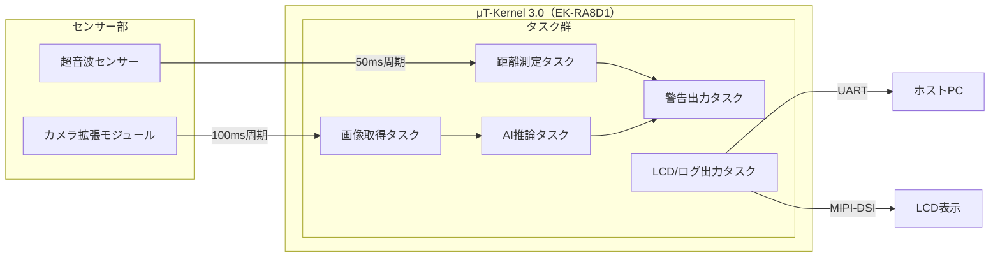

# 1. 応募プログラム名

**自転車後方接近物AI検知＆警告システム**

# 2. 概要説明

後方小型カメラおよび超音波センサーで得られる映像・距離データを、TensorFlow Lite for Microcontrollers（TinyML）による学習済みモデルで「人／車／バイク」にリアルタイム分類。
μT-Kernel 3.0上でセンサー取得・AI推論・警告出力をタスク分割し、LED点滅・振動モーター・LCD表示でライダーに警告します。

# 3. 開発体制

* **個人開発**

  * 担当：中山颯遵（プログラム設計・実装・評価）
* **協力予定**

  * AIモデル軽量化アドバイザ（TensorFlowコミュニティ／オンライン）
  * ハードウェア評価パートナー（自転車愛好家）

# 4. 開発環境およびプログラム

* **ホストPC**

  * OS：Windows 11 Pro または Ubuntu 22.04 LTS
  * IDE：Renesas **e² studio**（FSP構成ツール）＋Visual Studio Code（補助）

* **ターゲット**

  * **Renesas EK-RA8D1**（Arm Cortex-M85, Helium, 480 MHz）
  * 同梱MIPI LCD拡張（480×854, 静電タッチ）
  * 同梱カメラ拡張（約3MP CMOS）
  * 超音波距離センサー（HC-SR04互換, 3.3V対応）
  * 振動モーター、LED

* **RTOS / ライブラリ**

  * μT-Kernel 3.0（アプリ層）
  * Flexible Software Package（FSP）ドライバ（UART, GPT, I²C/SPI, DSI/LCD, Camera）
  * TensorFlow Lite for Microcontrollers（INT8量子化, CMSIS-NN/Helium最適化）

* **言語**

  * C（RTOS/タスク）＋C++（推論ラッパ）

# 5. 開発規模

* **ソースコード行数**（見込み）：約2,500行
* **主要ファイル構成**

  * センサー制御：sensor.c / sensor.h
  * AI推論：ai\_infer.c / model\_data.cc
  * 警告出力：alert.c / alert.h
  * LCD/UI表示：ui\_display.c / ui\_display.h
  * メイン制御：main.c
  * ドライバラッパ：drivers/…

# 6. 機能説明

| 機能        | 詳細                                      |
| --------- | --------------------------------------- |
| 距離測定タスク   | 超音波センサーから50ms周期で距離データ取得                 |
| 画像取得タスク   | カメラモジュールから100ms周期でフレーム取得（QVGAへ縮小）       |
| AI推論タスク   | TinyMLモデルで「人／車／バイク」分類、Helium最適化により高速実行  |
| 危険度評価     | 接近距離＋分類結果を統合し“低／中／高”の危険度を算出             |
| 警告出力タスク   | LED点滅パターン・振動強度を危険度に応じて制御                |
| デバッグ/表示出力 | UART経由でログ送信＋MIPI LCDにクラス/距離/危険度/処理時間を表示 |

## システム構成図

# 7. 応募プログラムのアピールポイント

* **高性能リアルタイムAI**：Cortex-M85 + Heliumにより、TinyML推論をリアルタイム周期内で実行可能
* **可視化・デモ性**：MIPI LCDで危険度をオーバレイ表示、現場で誤検知の調整が容易
* **RTOS＋FSPの共存**：μT-Kernelのタスク管理とFSPドライバを組み合わせ、効率と保守性を両立
* **安全性**：距離情報とAI分類を組み合わせ、誤検知を低減し実用的な警告を実現

# 8. 応募者のアピールポイント

* 42Tokyoでの低レイヤC/C++課題経験
* Flaskアプリ開発経験によるソフトウェア設計力
* ネットワーク・AI・組込み制御の知見を横断活用
* μT-Kernel上でTinyMLを動作させる実践的挑戦