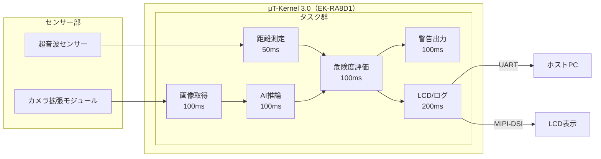

# 1. 応募プログラム名

**自転車後方接近物AI検知＆マルチモーダル警告システム**

# 2. 背景・課題設定

自転車事故の中でも、後方からの接近車両・バイク・歩行者への気づき遅れは重大事故につながります。
既存の対策（ミラー、目視確認、単純な距離センサー）は以下の課題があります。

- ミラー/目視：確認タイミングが運転者依存で、暗所や疲労時に見落としが発生
- 単一センサー：物体種別が分からず、不要な警告が増える
- スマホ連携型：通信やOS依存でリアルタイム性・安定性に課題

本提案は、**距離情報（超音波）×画像AI分類（TinyML）**を組み合わせ、
組込み単体でリアルタイムに危険度を判定し、誤警報を抑えた実用的な警告を実現します。

# 3. 提案概要（何を作るか）

後方小型カメラと超音波センサーのデータを、TensorFlow Lite for Microcontrollers（以下、TFLM）で推論し、
「人／車／バイク」を分類。μT-Kernel 3.0上でタスク分割して並列処理し、
**LED・振動モーター・LCD**の3系統でライダーに通知します。

## 3.1 目標ユーザー

- 通勤・通学サイクリスト
- 夜間走行が多いユーザー
- 交通量の多い市街地を走るユーザー

## 3.2 提供価値

- 視線移動なしで危険把握（振動＋LED）
- 物体種別付きの説明可能な警告（LCD表示）
- MCU単体で完結する低遅延・高信頼構成

# 4. 独自性・審査員向け訴求ポイント

1. **マルチモーダル判定**：距離だけでなく物体種別を統合し、不要警報を低減
2. **リアルタイムOS設計**：μT-Kernel上でセンシング・推論・通知を分離し、周期保証を明確化
3. **エッジAI最適化**：INT8量子化＋Helium最適化で、クラウド不要の高速推論
4. **デモ性の高さ**：MIPI LCDで「距離・種別・危険度・推論時間」を可視化し審査時に説明しやすい
5. **実装再現性**：FSPドライバ活用で、同系ボードへの移植可能性が高い

# 5. 開発体制

- **開発形態**：個人開発
- **担当**：中山颯遵（要件定義、実装、評価、デモ構築）
- **協力予定**
  - AIモデル軽量化アドバイザ（TensorFlowコミュニティ／オンライン）
  - 実走評価パートナー（自転車愛好家）

# 6. 開発環境・使用技術

## 6.1 ハードウェア

- **Renesas EK-RA8D1**（Arm Cortex-M85, Helium, 480MHz）
- MIPI LCD拡張（480×854）
- カメラ拡張モジュール（約3MP CMOS）
- 超音波距離センサー（HC-SR04互換, 3.3V対応）
- 振動モーター、LED

## 6.2 ソフトウェア

- μT-Kernel 3.0（タスク管理・同期）
- Renesas FSP（UART, GPT, I²C/SPI, Camera, DSI/LCD）
- TensorFlow Lite for Microcontrollers（INT8量子化）
- CMSIS-NN/Helium最適化

Helium（M-Profile Vector Extension）活用により、推論カーネルの一部で
従来のCortex-M4/M7世代実装比 **1.5〜2.0倍程度の高速化**を目標値として設定し、
RA8D1採用の妥当性を性能面から明確化します。

## 6.3 開発環境

- ホストOS：Windows 11 Pro または Ubuntu 22.04 LTS
- IDE：Renesas `e² studio` + Visual Studio Code
- 言語：C（制御）+ C++（推論ラッパ）

# 7. システム設計

## 7.1 タスク構成と周期

| タスク | 周期 | 役割 | 目標実行時間 |
|---|---:|---|---:|
| 距離測定タスク | 50ms | 超音波計測、移動平均で平滑化 | 2ms以下 |
| 画像取得タスク | 100ms | フレーム取得・前処理（QVGA縮小） | 12ms以下 |
| AI推論タスク | 100ms | 人/車/バイク分類 | 30ms以下 |
| 危険度評価タスク | 100ms | センサー融合、危険度算出 | 3ms以下 |
| 警告出力タスク | 100ms | LED/振動パターン制御 | 2ms以下 |
| 表示/ログ出力タスク | 200ms | LCD更新、UARTログ送信 | 10ms以下 |

## 7.2 危険度ロジック（例）

- **低**：距離 > 3.0m または低信頼検出
- **中**：1.5m < 距離 ≤ 3.0m かつ（車/バイク/人）
- **高**：距離 ≤ 1.5m かつ（車/バイク）

補正ルール：

- 連続3フレーム一致で確定（瞬間誤検知を抑制）
- 接近速度推定（距離変化）で危険度を1段階引き上げ可能

## 7.3 警告UI仕様

- **LED**：低=ゆっくり点滅、中=通常点滅、高=高速点滅
- **振動**：低=弱パルス、中=中パルス、高=連続強振動
- **LCD**：`Class / Distance / Risk / Inference(ms)`を常時表示

## 7.4 システム構成図

## 7.5 省電力設計（実用性強化）

- 通常時は高応答モード（既定周期）で危険検知を優先
- 低リスク継続時はセンシング周期を段階的に緩和し、消費電力を抑制
- μT-Kernelのイベントフラグを用いた状態遷移で、必要時のみ高負荷処理へ復帰
- 省電力制御の有効性は、モード別の平均電流値比較で評価予定

# 8. 実装規模・ファイル構成

- **想定コード規模**：約2,500〜3,200行
- **主要構成**
  - `main.c`：初期化・タスク起動
  - `sensor.c/.h`：超音波取得・フィルタ
  - `camera_input.c/.h`：フレーム取得・前処理
  - `ai_infer.c/.h`：TFLM推論、信頼度計算
  - `risk_eval.c/.h`：センサー融合・危険度算出
  - `alert.c/.h`：LED/振動出力制御
  - `ui_display.c/.h`：LCD描画・デバッグ表示
  - `model_data.cc`：量子化済みモデル
  - `drivers/`：FSPラッパ層

# 9. 開発計画（4か月）

| 月 | マイルストーン | 成果物 |
|---|---|---|
| Month 1 | 基盤構築（センサー・LCD・ログ・タスク雛形） | 距離取得と表示が安定動作、UARTログ、μT-Kernelタスク間連携の確認 |
| Month 2 | 画像パイプラインとAI推論実装 | QVGA前処理、TFLM統合、推論時間計測、Helium最適化の初期評価 |
| Month 3 | センサー融合・警告制御・省電力実装 | 危険度判定ロジック、LED/振動/LCD連動、イベントフラグによるモード遷移の実装 |
| Month 4 | 実走想定評価・最終チューニング・成果物化 | KPI評価レポート、最終デモ動画/資料、再現手順を含む提出物一式 |

# 10. 評価方法・達成目標（KPI）

## 10.1 機能KPI

- 推論周期：100ms周期を95%以上で維持
- 危険判定遅延：接近検知から警告まで200ms以内
- 分類精度（簡易検証データ）：人/車/バイク平均70%以上
- 誤警報率：単純距離閾値方式比で20%以上削減
- 省電力効果：低リスク時に通常モード比10%以上の平均消費電流低減を目標

## 10.2 計測項目

- タスク実行時間（min/avg/max）
- フレーム欠落率
- 危険度判定の安定性（連続判定一致率）
- 実走模擬シナリオでの反応時間

## 10.3 検証シナリオ

- 直進時に後方から車両接近
- 歩行者が後方から斜め接近
- バイクが高速で接近
- 夜間相当（照度低下）条件での誤警報確認

# 11. リスクと対策

| リスク | 影響 | 対策 |
|---|---|---|
| 推論が周期内に収まらない | リアルタイム性低下 | 入力解像度削減、演算子最適化、処理優先度見直し |
| 照度不足で認識精度低下 | 誤判定増加 | 距離重みを上げるフェイルセーフ、閾値切替 |
| 超音波ノイズ | 誤警報 | 移動平均＋外れ値除去、連続一致判定 |
| モーター駆動ノイズが他系へ影響 | 不安定動作 | 電源分離・駆動タイミング制御・デカップリング |

# 12. 成果物・デモ計画

- 動作デモ（実機）：後方接近時にLED/振動/LCDが連動
- 画面表示：物体種別、距離、危険度、推論時間
- 評価レポート：KPI実測値と改善履歴
- ソースコード一式：再現手順付き

# 13. 今後の展望

- センサ追加（IMU）による姿勢変化考慮
- モデル再学習による夜間・悪天候対応強化
- BLE連携によるヘルメット/スマートウォッチ通知

# 14. 応募者のアピールポイント

- 42 TokyoのCommon Coreを通じ、標準ライブラリ利用制約下で実装を積み重ね、OSの仕組み・メモリ管理・低レイヤ最適化を実践的に習得
- ウェブ開発経験に基づく設計・検証プロセスの実践力
- AI・組込み・ネットワークを横断して統合できる強み
- μT-Kernel上でTinyMLを実装し、実機で価値を示す実行力